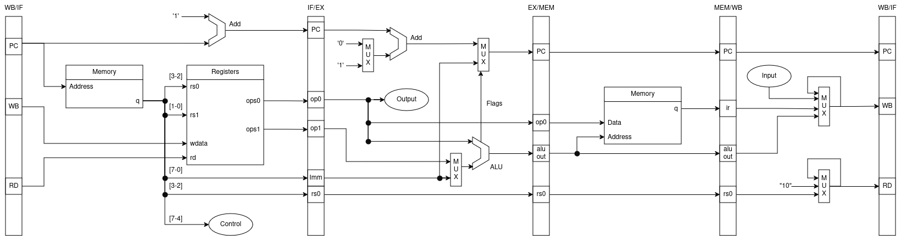
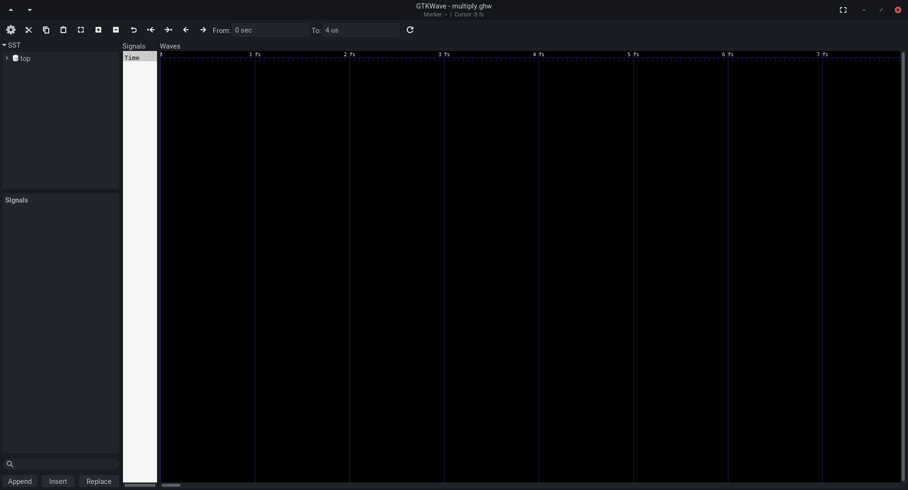
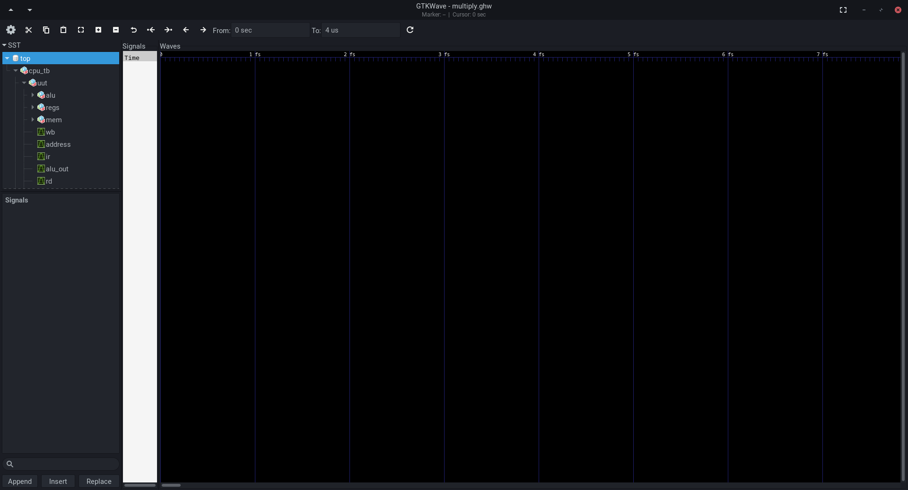
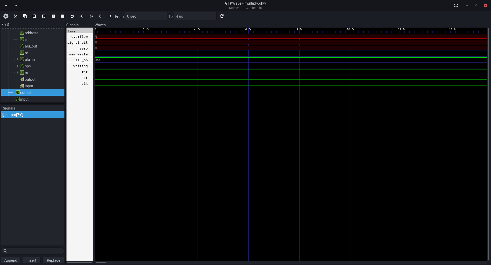

# Relatório: Projeto de uma CPU de 8-bits

## Autores

| Nome                       | nUSP     |
|:-------------------------- |:-------- |
| Guilherme de Abreu Barreto | 12543033 |
| João Vitor Naldoni         | 13748102 |
| Jorge Salhani              | 8927418  |

## Resumo

O presente documento descreve o projeto de um processador com 8 bits de endereçamento, denominado **Mefisto**. Iniciamos por definir as instruções de máquina que este comporta, seus componentes e arquitetura, assim como as decisões de projeto tomadas na formulação destes. No mais, ao final fornecemos as instruções necessárias para o uso de seu montador para a criação de novos programas para o processador e a realização da simulação de sua operação fazendo uso de um montador escrito em Python, o simulador [GHDL](http://ghdl.free.fr/) e a interface [GTKWave](https://github.com/gtkwave/gtkwave), programas estes prontamente disponíveis para instalação em uma variedade de distribuições Linux.

## Sumário

1. Instruções de máquina

   1. Entradas e Saídas
   2. Formato de instrução
   3. Instruções implementadas
   4. Endereçamento dos registradores

2. Arquitetura da CPU

   1. Componentes
   2. Unidade de Controle e diagrama esquemático do circuíto
   3. Unidade Lógico-Aritmética
   4. Banco de registadores e Memória Primária

3. Instruções de Uso

   1. Dependências e considerações iniciais
   2. Gerando programas com o montador
   3. Gerando um testbench para teste da CPU
   4. Gerando uma simulação visualizando os resultados desta

## Instruções de máquina

### Entradas e saídas

Encontram-se especificadas as seguintes entradas e saídas para a CPU Mefisto:

```vhdl
entity CentralProcessingUnit is
    port (
        input         : in  std_logic_vector(inst_r);
        clk, set, rst : in  std_logic;
        output        : out std_logic_vector(inst_r);
        waiting       : out std_logic
    );
end entity CentralProcessingUnit;
```

Os nomes dos sinais seguem convenções vistas em circuitos elétricos. Os principais diferenciais é a definição de `inst_r` como sendo a largura de instrução de 8-bits, e o uso de um output "waiting" para indicar que a CPU está aguardando o input do usuário, a ser digitado em `input` e confirmado com `set`.

### Formato de instrução

Mefisto faz uso de um único formato de instrução fixado como:

| func    | rs0 | rs1/Imm |
|:------- |:--- |:------- |
| 7 6 5 4 | 3 2 | 1 0     |

Sendo:

- **func**: A funcionalidade a ser executada;
- **rs0**: Endereço do registrador utilizado como primeiro operador;
- **rs1**: Endereço do registrador, ou indicação de valor imediato `11`, a ser utilizado como segundo operador.
- **7 à 0:** Os índices de cada bit da instrução.

Na descrição das instruções, utilizamos um par de dígitos hexadecimais, por exemplo: `x"C0", -- DIN A`

### Instruções implementadas

Mefisto implementa 16 funções, as quais são listadas a seguir. Quando estas podem, ou devem, comportar um valor imediato, estas estão seguidas de `> Imm` para identificar a presença deste na posição de memória seguinte àquela em que a instrução foi lida.

No mais, Mefisto possui apenas 3 registradores, denominados A, B e R. Estes são indicados, respectivamente, com os pares de bits `00`, `01` e `10`. Nem todas as instruções fazem uso de um ou dois operadores, nestes casos fica indicado nas instruções abaixo com `X` quando os bits não são utilizados.

#### NOP

**Exemplo:** `NOP`

**Formato:** `0 | X | X > Imm`

**Descrição:** Sem operação; isto é, descarta um ciclo de execução.

#### ADD

**Exemplo:** `ADD A B`

**Formato:** `1 | rs0 | rs1 > Imm`

**Descrição:** Soma dois valores, ativa flags correspondentes, e atribui o resultado ao registrador `R`.

#### SUB

**Exemplo:** `SUB R 1`

**Formato:** `2 | rs0 | rs1 > Imm`

**Descrição:** Subtrai de `rs0` o valor `rs1/Imm`, ativa flags correspondentes, e atribui o resultado ao registrador `R`.

#### CMP

**Exemplo:** `CMP A 0`

**Formato:** `3 | rs0 | rs1 > Imm`

**Descrição:** Subtrai de `rs0` o valor `rs1/Imm`, ativa flags correspondentes, e descarta o resultado. Utilizado para comparar se o primeiro valor é maior ou igual ao segundo.

#### AND

**Exemplo:** `AND A B`

**Formato:** `4 | rs0 | rs1 > Imm`

**Descrição:** Aplica a operação E lógico entre dois valores, ativa flags correspondentes e atribui o resultado ao registrador `R`.

#### OR

**Exemplo:** `OR R B`

**Formato:** `5 | rs0 | rs1 > Imm`

**Descrição:** Aplica a operação OU lógico entre dois valores, ativa flags correspondentes e atribui o resultado ao registrador `R`.

#### NOT

**Exemplo:** `NOT A`

**Formato:** `6 | rs0 | X`

**Descrição:** Aplica a operação de negação lógica a um valor armazenado, ativa flags correspondentes e atribui o resultado ao registrador `R`.

#### JMP

**Exemplo:** `JMP LOOP_START`

**Formato:** `7 | X | X > Imm`

**Descrição:** Atribui ao Program Counter o valor associado a *label* descrita.

#### JEQ

**Exemplo:** `JEQ LOOP_END`

**Formato:** `8 | X | X > Imm`

**Descrição:** Atribui ao Program Counter o valor associado a *label* descrita, se o resultado da última operação lógica ou aritmética for 0.

#### JGR

**Exemplo:** `JGR LOOP_END`

**Formato:** `9 | X | X > Imm`

**Descrição:** Atribui ao Program Counter o valor associado a *label* descrita, se na última operação aritmética `rs0` for maior que `rs1`.

#### LOAD

**Exemplo:** `LOAD A 255`

**Formato:** `A | rs0 | X > Imm`

**Descrição:** Atribui ao registador `rs0` o conteúdo armazenado na memória na posição indicada por um índice de 0 à 255.

#### STORE

**Exemplo:** `STORE B 255`

**Formato:** `B | rs0 | X > Imm`

**Descrição:** Atribui à memória na posição indicada por um índice de 0 a 255 o conteúdo armazenado no registrador `rs0`.

#### IN

**Exemplo:** `IN A`

**Formato:** `C | rs0 | X`

**Descrição:** Atribui ao registrador `rs0` o conteúdo em `input` quando feita a confirmação de que o valor está seguro com `set`.

#### OUT

**Exemplo:** `OUT R`

**Formato:** `D | rs0 | X`

**Descrição:** Envia a `output` o conteúdo armazenado em `rs0`.

#### MOV

**Exemplo:** `MOV A R`

**Formato:** `E | rs0 | rs1 > Imm`

**Descrição:** Atribui à `rs0` o valor em `rs1`.

#### HALT

**Exemplo:** `HALT`

**Formato:** `F | X | X`

**Descrição:** Interrompe a execuçã odo programa até que seja emitido um sinal `rst`.

## Endereço dos registradores

As seguintes combinações de registradores e valores imediatos são possíveis:

| Hex| Opção |
| :--- | :--- |
| 0 | A A |
| 1 | A B |
| 2 | A R |
| 3 | A Imm |
| 4 | B A |
| 5 | B B |
| 6 | B R |
| 7 | B Imm |
| 8 | R A |
| 9 | R B |
| A | R R |
| B | R Imm |

## Arquitetura da CPU


### Componentes

Mefisto integra uma Unidade de Controle (UC), uma Unidade Lógico-Aritmética (ULA), um banco de registradores e uma memória primária. Além de alguns registradores auxiliares.

### Unidade de Controle e diagrama esquemático do circuíto

A UC é responsável por controlar o fluxo de dados de acordo com as instruções lidas e realizar a passagem entre os diferentes estágios de execução da CPU. Esta está descrita enquanto um processo no arquivo [CPU.vhdl](./CPU.vhdl). Os estágios de execução implementados em Mefisto são:

- **Fetch (Buscar):** Atribui ao registrador de instrução o valor na memória apontado pelo Program Counter, e incrementa este último; Direciona as porções de bits relevantes a função a UC e relevantes aos registradores ao banco de registradores.

- **Execute (Executar):** A depender da função a ser executada, aqui são realizados:
    - Desvio condicional do PC;
    - Operacionalização da ULA;
    - Emissão do conteúdo de um registrador à saída;
    - Determinação do próximo estágio de execução;

- **Memory Access (Acesso à Memória):** No caso de instruções do tipo LOAD ou STORE, operacionaliza a Memória para leitura ou escrita.

- **Write back (Armazenar Resultado):** Escreve o resultado da operação ao banco de registradores, quando aplicável, e retoma o endereçamento da memória para o Program Counter.

O seguinte diagrama esquematiza estas etapas de execução e os componentes envolvidos em cada uma destas:



A notável exceção do canônico estágio de decodificação (Decode) se faz presente porque todas as instruções implementadas por Mefisto seguem um mesmo formato. Prescindindo a necessidade de identificar os componentes da instrução.

### Unidade Lógico-Aritmética

A ULA está descrita no arquivo [ALU.vhdl](./ALU.vhdl). Esta implementa as funcionalidades de soma, subtração, algumas operações lógicas e a opção para se repassar inalterado um valor imediato recebido. Esta também emite sinais indicativos de um resultado nulo (`zero`), positivo ou negativo (`signal_bit`).

### Banco de registradores e Memória primária

Estes encontram-se descritos, respectivamente, nos arquivos [registers.vhdl](./registers.vhdl) e [memory.vhdl](./memory.vhdl). A implementação destes é bastante similar. As principais diferenças entre estes é:

- O primeiro tem capacidade de armazenamento muito menor (4 palavras) que o segundo (256 palavras).

- O primeiro faz acesso a duas palavras simultaneamente, enquanto o segundo acessa apenas uma.

- O primeiro possui acesso assíncrono e o segundo síncrono.

A implementação da memória foi feita de maneira a comportar as mesmas entradas e saídas vistas para a memória RAM em Bloco (BRAM) das placas FPGA.

## Instruções de Uso

### Dependências e considerações iniciais

Antes de prosseguir nas etapas seguintes, note:

1. faz-se necessária a instalação das ferramentas `make`, `python`, `ghdl` e `gtkwave`. Recomenda-se obtê-las por meio do gerenciador de pacotes recomendado pela sua distribuição Linux. Também recomenda-se um editor de texto adequado a escrita nas linguagens `vhdl` e `asm` como o [LunarVim](https://www.lunarvim.org/).
2. Para cada novo programa a ser testado será necessário primeiro escrevê-lo em um arquivo `.asm` e possuir um arquivo de testbench compatível. A geração destes será explicada a seguir. Após isso ter sido feito, Mefisto possui um Makefile que realiza todas as etapas necessárias para a geração de uma simulação e visualização dos resultados desta, o qual pode ser utilizado com o seguinte comando:

```sh
make PROGRAM="multiply.asm" TESTBENCH="cpu_tb.vhdl" TIME="4us"
```

Onde `TIME` é o tempo total de execução da simulação.

### Gerando programas como montador

Escreva um programa a ser executado e salve-o em um arquivo. Tal como o seguinte programa de exemplo:

```asm

; Programa salvo em um arquivo nomeado "multiply.asm"

IN A
IN B
MOV R 0
LOOP_START:
    CMP B 0
    JEQ LOOP_END
    ADD R A
    STORE R 255
    SUB B 1
    MOV B R
    LOAD R 255
    JMP LOOP_START
LOOP_END:
    OUT R
    WAIT
```

Note algumas características deste código:

- Comentários são acrescentados após o marcador `;`.
- Indentação é utilizada de forma liberal, ainda que não implique em qualquer funcionalidade.
- **Funções e argumentos são separados entre si por espaços**, diferentemente doutras linguagens de montagem que utilizam vírgulas para este mesmo propósito.

O uso do compilador `assembler.py` é feito da seguinte forma:

```sh
python assembler.py multiply.asm
```

Gerando os arquivos `multiply_t.vhdl` e `memory.vhd` na mesma pasta em que o comando foi invocado. O primeiro refere-se ao programa gerado, enquanto o segundo refere-se a descrição da memória com este mesmo programa nela carregado.

### Gerando um testbench para teste da CPU

Para realização de uma simulação da execução da CPU, utiliza-se de um arquivo denominado "testbench" para descrever quaisquer sequências de entradas atuada sobre esta (denominada UUT: "*Unit Under Test*"). Assim como realizar a captura de quaisquer sinais de saída, ou internos, a mesma.

Um exemplo de testbench está descrito no arquivo [cpu_tb.vhdl](./cpu_tb.vhdl). Observe neste a existência de dois processos:

- `clk_process`: Descreve a geração do pulso regular de um *clock*. Esta porção do testbench tende a não se alterar entre diferentes testes.
- `stimulation`: Descreve a emissão de sinais para a CPU, as quais podem ser simultâneas ou intervaladas entre si. **Esta é a porção do código que necessita ser alterada em função do teste sendo realizado**.

Comum a ambos estes processos está a constante **period**, que pode assumir qualquer valor previsto tipo `time`.

### Gerando uma simulação e visualizando os resultados desta

Gerados os arquivos descrevendo o programa e o procedimento para testá-lo (testbench), executa-se o comando `make` tal qual especificado anteriormente, o que faz lançar uma janela semelhante à seguinte:



À esquerda a um item `top` que ao ser selecionado destrincha um menu com os componentes sendo testados:



Selecionando um deles, seus respectivos sinais internos são listados sob `Signals`. Estes então podem ser selecionados e adicionados à visualização selecionando o botão `Insert`.



Inicialmente, a exibição da onda encontra-se na escala de femtosegundos, uma unidade bastante breve de tempo (um quadrilhésimo de segundo) para os propósitos de uma CPU. Recomenda-se aumentar o intervalo para a escala de nanosegundos usando o atalho `Ctrl+-`.


Ajustada a escala de tempo, continue a inserir sinais os quais julgar relevantes à exibição. A ordem em que estes são exibidos também pode ser ajustada arrastando-os a posição desejada na listagem.

