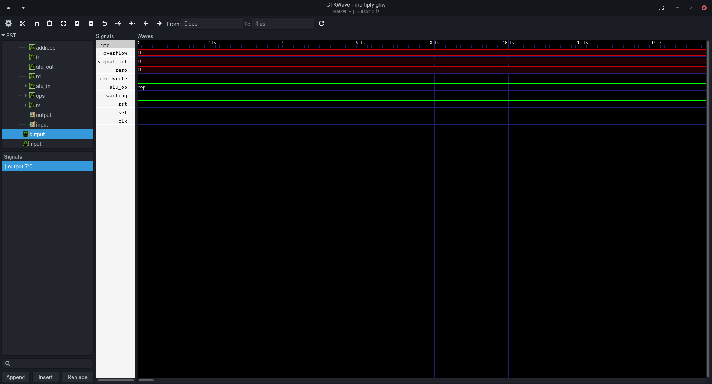

# Mephisto: An 8-bit CPU Project

**Nota do tradutor:** Esta é a versão em Inglês do README.
[Acesse aqui a versão original em Português](README.md)

## Authors

| Name                       | nUSP     |
| :------------------------- | :------- |
| Guilherme de Abreu Barreto | 12543033 |
| João Vitor Naldoni         | 13748102 |
| Jorge Salhani              | 8927418  |

## Abstract

This document describes the design of an 8-bit addressing processor called
**Mephisto**. We begin by defining the machine instructions it supports, its
components and architecture, as well as the design decisions made in their
formulation. We provide the necessary instructions for using its assembler to
create new programs and simulate its operation. For that, we make use of the
Python interpreter, the [GHDL](http://ghdl.free.fr/) simulator, and the
[GTKWave](https://github.com/gtkwave/gtkwave) interface; programs readily
available for installation on various Linux distributions.

## Table of Contents

1. [**Machine Instructions**](#machine-instructions)
   - 1.1. [Inputs and Outputs](#inputs-and-outputs)
   - 1.2. [Instruction Format](#instruction-format)
   - 1.3. [Implemented Instructions](#implemented-instructions)
   - 1.4. [Register Addressing](#register-addressing)
2. [**CPU Architecture**](#cpu-architecture)
   - 2.1. [Components](#components)
   - 2.2.
     [Control Unit and Circuit Schematic](#control-unit-and-circuit-schematic)
   - 2.3. [Arithmetic Logic Unit](#arithmetic-logic-unit)
   - 2.4. [Register Bank and Primary Memory](#register-bank-and-primary-memory)
3. [**Usage Instructions**](#usage-instructions)
   - 3.1.
     [Dependencies and Initial Considerations](#dependencies-and-initial-considerations)
   - 3.2.
     [Generating Programs with the Assembler](#generating-programs-with-the-assembler)
   - 3.3.
     [Generating a Testbench for CPU Testing](#generating-a-testbench-for-cpu-testing)
   - 3.4.
     [Generating a Simulation and Visualizing Results](#generating-a-simulation-and-visualizing-results)

## Machine Instructions

### Inputs and Outputs

The following inputs and outputs are specified for the Mephisto CPU:

```vhdl
entity CentralProcessingUnit is
    port (
        input         : in  std_logic_vector(inst_r);
        clk, set, rst : in  std_logic;
        output        : out std_logic_vector(inst_r);
        waiting       : out std_logic
    );
end entity CentralProcessingUnit;
```

The signal names follow conventions seen in electrical circuits. The main
differences are:

- the definition of `inst_r` as the 8-bit instruction width, and

- the use of a "waiting" output to indicate that the CPU is waiting for user
  input, to be entered in `input` and confirmed with `set`.

### Instruction Format

Mephisto uses a single fixed instruction format:

| func    | rs0 | rs1/Imm |
| :------ | :-- | :------ |
| 7 6 5 4 | 3 2 | 1 0     |

Where:

- **func**: The functionality to be executed;
- **rs0**: Address of the register used as the first operand;
- **rs1**: Address of the register, or indication of immediate value `11`, to be
  used as the second operand.
- **7 to 0:** The indices of each instruction bit.

In the instruction descriptions, we use a pair of hexadecimal digits, for
example: `x"C0", -- DIN A`

### Implemented Instructions

Mephisto implements 16 functions, which are listed below. When these can, or
should, include an immediate value, they are followed by `> Imm` to identify the
presence of this value in the memory position immediately following the one
where the instruction was read.

Mephisto has only 3 registers, named A, B and R. These are indicated,
respectively, with the bit pairs `00`, `01` and `10`. Not all instructions use
one or two operands; in these cases, it is indicated in the instructions below
with `X` when the bits are not used.

#### NOP

**Example:** `NOP`

**Format:** `0 | X | X`

**Description:** No operation; that is, discards an execution cycle.

#### ADD

**Example:** `ADD A B`

**Format:** `1 | rs0 | rs1 > Imm`

**Description:** Adds two values, activates corresponding flags, and assigns the
result to register `R`.

#### SUB

**Example:** `SUB R 1`

**Format:** `2 | rs0 | rs1 > Imm`

**Description:** Subtracts the value `rs1/Imm` from `rs0`, activates
corresponding flags, and assigns the result to register `R`.

#### CMP

**Example:** `CMP A 0`

**Format:** `3 | rs0 | rs1 > Imm`

**Description:** Subtracts the value `rs1/Imm` from `rs0`, activates
corresponding flags, and discards the result. Used to compare if the first value
is greater than or equal to the second.

#### AND

**Example:** `AND A B`

**Format:** `4 | rs0 | rs1 > Imm`

**Description:** Applies the logical AND operation between two values, activates
corresponding flags, and assigns the result to register `R`.

#### OR

**Example:** `OR R B`

**Format:** `5 | rs0 | rs1 > Imm`

**Description:** Applies the logical OR operation between two values, activates
corresponding flags, and assigns the result to register `R`.

#### NOT

**Example:** `NOT A`

**Format:** `6 | rs0 | X`

**Description:** Applies the logical negation operation to a stored value,
activates corresponding flags, and assigns the result to register `R`.

#### JMP

**Example:** `JMP LOOP_START`

**Format:** `7 | X | X > Imm`

**Description:** Assigns to the Program Counter the value associated with the
described _label_.

#### JEQ

**Example:** `JEQ LOOP_END`

**Format:** `8 | X | X > Imm`

**Description:** Assigns to the Program Counter the value associated with the
described _label_, if the result of the last logical or arithmetic operation
was 0.

#### JGR

**Example:** `JGR LOOP_END`

**Format:** `9 | X | X > Imm`

**Description:** Assigns to the Program Counter the value associated with the
described _label_, if in the last arithmetic operation `rs0` was greater than
`rs1`.

#### LOAD

**Example:** `LOAD A 255`

**Format:** `A | rs0 | X > Imm`

**Description:** Assigns to register `rs0` the content stored in memory at the
position indicated by an index from 0 to 255.

#### STORE

**Example:** `STORE B 255`

**Format:** `B | rs0 | X > Imm`

**Description:** Assigns to memory at the position indicated by an index from 0
to 255 the content stored in register `rs0`.

#### IN

**Example:** `IN A`

**Format:** `C | rs0 | X`

**Description:** Assigns to register `rs0` the content in `input` when
confirmation is made that the value is safe with `set`.

#### OUT

**Example:** `OUT R`

**Format:** `D | rs0 | X`

**Description:** Sends to `output` the content stored in `rs0`.

#### MOV

**Example:** `MOV A R`

**Format:** `E | rs0 | rs1 > Imm`

**Description:** Assigns to `rs0` the value in `rs1`.

#### HALT

**Example:** `HALT`

**Format:** `F | X | X`

**Description:** Interrupts program execution until a `rst` signal is emitted.

## Register Addressing

The following combinations of registers and immediate values are possible:

| Hex | Option |
| :-- | :----- |
| 0   | A A    |
| 1   | A B    |
| 2   | A R    |
| 3   | A Imm  |
| 4   | B A    |
| 5   | B B    |
| 6   | B R    |
| 7   | B Imm  |
| 8   | R A    |
| 9   | R B    |
| A   | R R    |
| B   | R Imm  |

## CPU Architecture

### Components

Mephisto integrates a Control Unit (CU), an Arithmetic Logic Unit (ALU), a
register bank, and primary memory. In addition to some auxiliary registers.

### Control Unit and Circuit Schematic

The CU is responsible for controlling data flow according to the instructions
read and performing transitions between the different execution stages of the
CPU. It is described as a process in the file [CPU.vhdl](./CPU.vhdl). The
execution stages implemented in Mephisto are:

- **Fetch:** Assigns to the instruction register the value in memory pointed to
  by the Program Counter, and increments the latter; Directs the bit portions
  relevant to the function to the CU and relevant to the registers to the
  register bank.

- **Execute:** Depending on the function to be executed, here are performed:

  - Conditional branching of the PC;
  - Operationalization of the ALU;
  - Emission of register content to output;
  - Determination of the next execution stage;

- **Memory Access:** In the case of LOAD or STORE type instructions,
  operationalizes the Memory for reading or writing.

- **Write back:** Writes the operation result to the register bank, when
  applicable, and resumes memory addressing for the Program Counter.

The following diagram schematizes these execution stages and the components
involved in each:


The notable exception of the canonical decoding stage (Decode) is present
because all instructions implemented by Mephisto follow the same format,
eliminating the need to identify instruction components.

### Arithmetic Logic Unit

The ALU is described in the file [ALU.vhdl](./ALU.vhdl). It implements the
functionalities of addition, subtraction, some logical operations, and the
option to pass through an unaltered received immediate value. It also emits
signals indicative of a null result (`zero`), positive or negative
(`signal_bit`).

The arithmetic operations assume and produce values corresponding to **unsigned
integers**: between 0 and 255 (inclusive).

### Register Bank and Primary Memory

These are described, respectively, in the files
[registers.vhdl](./registers.vhdl) and [memory.vhdl](./memory.vhdl). Their
implementation is quite similar. The main differences between them are:

- The first has much smaller storage capacity (4 words) than the second (256
  words).

- The first accesses two words simultaneously, while the second accesses only
  one.

- The first has asynchronous access and the second synchronous.

The memory implementation was done to accommodate the same inputs and outputs
seen for Block RAM (BRAM) in FPGA boards.

## Usage Instructions

### Dependencies and Initial Considerations

Before proceeding with the following steps, note:

1. Installation of the tools `make`, `python`, `ghdl` and `gtkwave` is required.
   It is recommended to obtain them through the package manager recommended by
   your Linux distribution. Also recommended is a text editor suitable for
   writing in the `vhdl` and `asm` languages such as
   [LunarVim](https://www.lunarvim.org/).
2. For each new program to be tested, it will be necessary to first write it in
   a `.asm` file and have a compatible testbench file. The generation of these
   will be explained next. After this is done, Mephisto has a Makefile that
   performs all the necessary steps for generating a simulation and visualizing
   its results, which can be used with the following command:

```sh
make PROGRAM="multiply.asm" TESTBENCH="cpu_tb.vhdl" TIME="4us"
```

Where `TIME` is the total simulation execution time.

### Generating Programs with the Assembler

Write a program to be executed and save it in a file. Such as the following
example program:

```asm

; Program saved in a file named "multiply.asm"

IN A
IN B
MOV R 0
LOOP_START:
    CMP B 0
    JEQ LOOP_END
    ADD R A
    STORE R 255
    SUB B 1
    MOV B R
    LOAD R 255
    JMP LOOP_START
LOOP_END:
    OUT R
    WAIT
```

Note some characteristics of this code:

- Comments are added after the marker `;`.
- Indentation, blank lines, and uppercase can be used liberally: they do not
  imply any functional change.
- **Functions and arguments are separated from each other by spaces**, unlike
  other assembly languages that use commas for this same purpose.

The use of the `assembler.py` compiler is done as follows:

```sh
python assembler.py multiply.asm
```

Generating the files `multiply_t.vhdl` and `memory.vhd` in the same folder where
the command was invoked. The first refers to the generated program, while the
second refers to the memory description with this same program loaded in it.

### Generating a Testbench for CPU Testing

To perform a simulation of CPU execution, a file called "testbench" is used to
describe any input sequences applied to it (called UUT: "_Unit Under Test_"). As
well as capturing any output signals, or internal ones, from it.

An example testbench is described in the file [cpu_tb.vhdl](./cpu_tb.vhdl). Note
in this the existence of two processes:

- `clk_process`: Describes the generation of the regular pulse of a _clock_.
  This portion of the testbench tends not to change between different tests.
- `stimulation`: Describes the emission of signals to the CPU, which can be
  simultaneous or interleaved with each other. **This is the portion of the code
  that needs to be changed depending on the test being performed**.

Common to both these processes is the constant **period**, which can assume any
value of type `time`.

### Generating a Simulation and Visualizing Results

Once the files describing the program and the procedure to test it (testbench)
are generated, execute the `make` command as specified earlier, which launches a
window similar to the following:


On the left there is a `top` item that when selected unfolds a menu with the
components being tested:


Selecting one of them, their respective internal signals are listed under
`Signals`. These can then be selected and added to the visualization by
selecting the `Insert` button.



Initially, the wave display is in the femtosecond scale, a very brief unit of
time (one quadrillionth of a second) for CPU purposes. It is recommended to
increase the interval to the nanosecond scale using the shortcut `Ctrl+-`.


With the time scale adjusted, continue inserting signals that you consider
relevant to the display. The order in which they are displayed can also be
adjusted by dragging them to the desired position in the listing.
